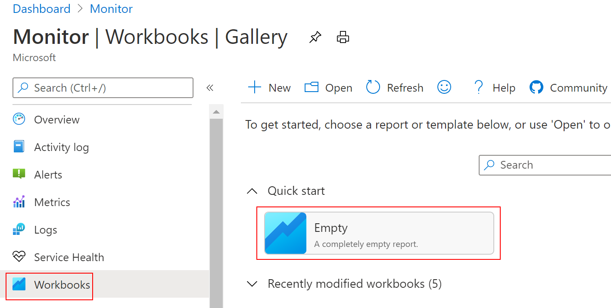
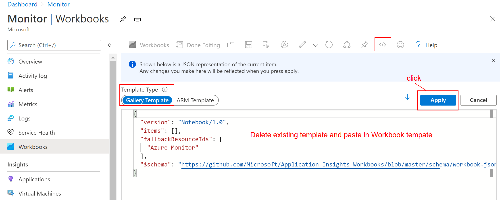
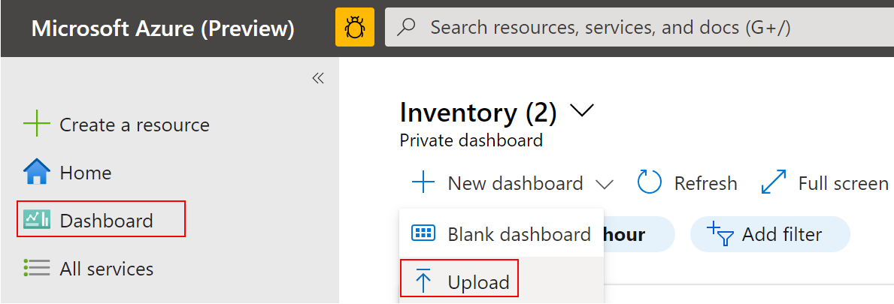

  Panorama is a project about making Azure environment observable, giving Azure users insights to deloyed resources, resource performance, capacity and security. This project is inspired by [Azure Monitor Community](https://github.com/microsoft/AzureMonitorCommunity), but with more focus on security monitoring.  
  The workbooks does not currently contain Location filtering as they are built for the purpose of, a local Goverment Commercial Cloud program where all resources are in Southeast Asia region.  
  But Location paramater can be easily added.

### Content
[Panorama Workbooks & Dasboard](#workbooks-and-dasboard)  
[Setup Workbook](#setup-a-workbook)  
[Setup Dashboard](#setup-a-dashboard)  
[Setup Log Collection](https://github.com/weixian-zhang/Panorama/blob/master/docs/SetupLogCollection.md)  
[Network Monitoring Guide](#network-monitoring-guide)  
[VM Monitoring Guide](#vm-monitoring-guide)

### Workbooks and Dasboard  
Panorama consists of the following artifacts:  
* Workbooks  
   * [Activity Insights](#activity-insights-workbook)
   * [IaaS Insights](#iaaS-insights-workbook)
   * [Firewall Insights](#firewall-insights-workbook)
   * [LogAnalytics Insights](#log-analytics-insights-workbook)
* Dashboard
   * [Inventory Dashboard](#inventory-dashboard)  

### Setup a Workbook
1. Copy Json content of any Panorama Workbook for example [IaaSInsights](https://github.com/weixian-zhang/Panorama/blob/master/Workbooks/IaaSInsights/IaaSInsights.workbook),  
2. In Azure Portal, go to **Monitor** and click on Workbook, select **Empty Workbook**  
3. Follow by clicking Code icon "</>"  
4. Under **Gallery Template**, delete existing Json and paste in IaaSInsights Workbook Json content and hit "Apply"
     
                         

### Setup a Dashboard  
1. Save [Inventory Dashboard](https://github.com/weixian-zhang/Panorama/blob/master/InventoryDashboard/Inventory.dashboard) as .json file on your machine.  
2. Upload .json dashboard.  
              

### Activity Insights Workbook    
* all general resource writes and deletes of your Azure environment
* Network Security Group changes, who made the change, what is the exact rule and the value changed. E.g: Access change from Deny to Allow, Destination Address to */Any.
* Azure Firewall rule changes, who made the change, a breakdown on exactly which NAT, Network and/or Application Rule is changed and the vault of change

### IaaS Insights Workbook  
This workbook contains 5 tabs:  
* VM Availability: A simple graph view of Azure Health metrics. Green means VM is available, Orange can means stopped or not available for whatever reasons.
* CPU & Memory: This gives you the details of each VM what is the current CPU consupmtion in % and the number of cores. For memory, it shows the Available Memory out of Total Memory of the VM spec.
* Disk Capacity: Breaks down all drives attached to each VM and shows the free space in each drive. ([D drive](https://docs.microsoft.com/en-us/azure/virtual-machines/windows/change-drive-letter) is a temp drive). Any disk lesser 15GB of free space will be marked Red.
* Patch Status: This tab gives you a <em>Grid Summary and Detail</em> view where you can select a VM in the Summary Table while the Details Table below shows you which patches are missing.  
* Change Tracking: Showcase 5 areas of changes: File, Windows Services, Linux Daemons, Software and Registry

### Firewall Insights Workbook  
This workbook categorizes traffics that are processed by Azure Firewall into 4 tabs filtered views of: Threat Intelligence, NAT, Network and Application FQDNs  

### Log Analytics Insights Workbook  
It operates 1 workspace at a time, contains a view of ingested logs in GB grouped by Monitoring Solution, and Kubernetes specific logs collection by enabling ContainerInsignts.  
### Inventory Dashboard
It contains 3 general categories:
* All Resources
* Virtual Machines: Number of Linux and Windows VMs and which VMs are running and which are not. Pie charts of VM grouped by Image Type and by VM SKU.
* Networking: All Virtual Networks and Subnets
  * Networking - NSG: whistleblowing which NSG has no rules,  
  Subnets with no NSG (excluding AzureFirewallSubnet and GatewaySubnet)  
  and which Inbound and/or Outbound rules has destination address * | Any | 0.0.0.0/0  
  
  * Networking - Public IP: Shows all resources with Public IPs and Public IPs not assiciated to any resource.
 
 ### Network Monitoring Guide
 This section provides a summary of the available Azure network monitoring tools and how to setup and use them.  
 A great [video](https://www.youtube.com/watch?v=3J97zMYhSCw) that covers all current Azure networking tools.
 
 #### Azure Load Balancer Insights  
   How does it help?  
   * Topology visuals on load balancer rule to backend-pool resources with colored link-lines to show traffic health
   * Data path availability and health probe status group by Frontend IP
   * ...more will be added
   references: [video](https://www.youtube.com/watch?v=qfzOTNKYTgU)  
   
   
  ### VM Monitoring Guide  
   

