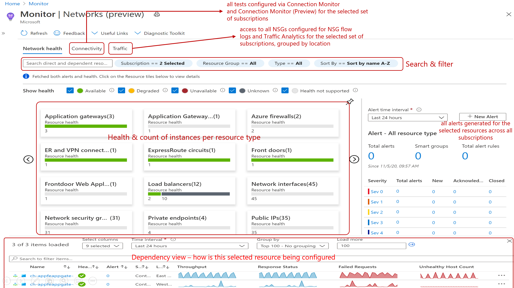
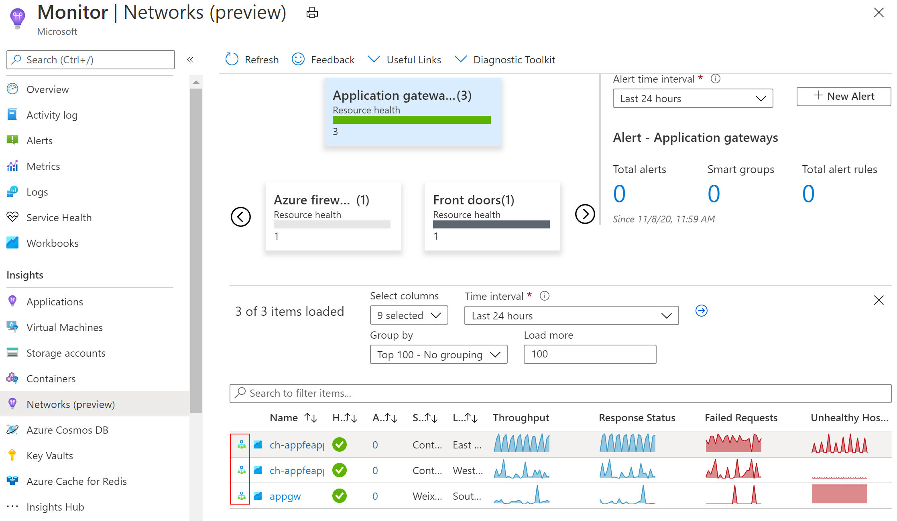
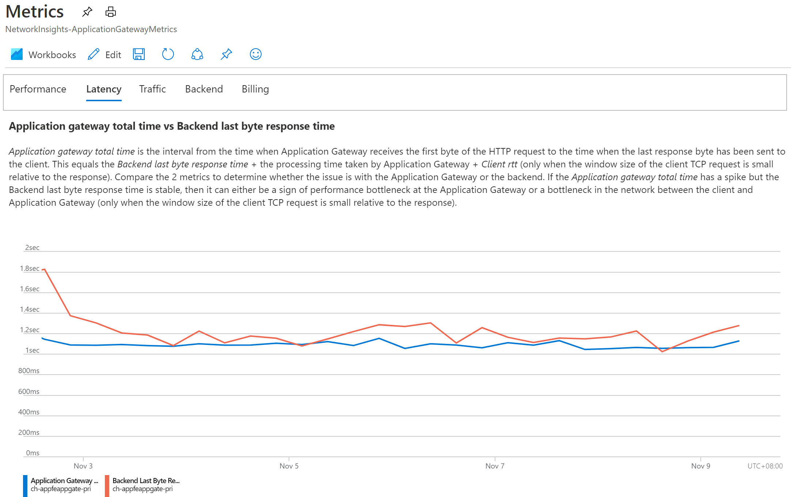

  Panorama is a project about making Azure environment observable, giving Azure users insights to deloyed resources, resource performance, capacity and security. This project is inspired by [Azure Monitor Community](https://github.com/microsoft/AzureMonitorCommunity), but with more focus on security monitoring.  
  The workbooks does not currently contain Location filtering as they are built for the purpose of, a local Goverment Commercial Cloud program where all resources are in Southeast Asia region.  

### Content
[Panorama Workbooks & Dasboard](#workbooks-and-dasboard)  
[Setup Workbook](#setup-a-workbook)  
[Setup Dashboard](#setup-a-dashboard)  
[Setup Azure Log Collection](https://github.com/weixian-zhang/Panorama/blob/master/docs/SetupLogCollection.md)  
[Network Monitoring Guide](#network-monitoring-guide)  

### Workbooks and Dasboard  
Panorama consists of the following artifacts:  
* Workbooks  
   * [Activity Insights](#activity-insights-workbook)
   * [IaaS Insights](#iaaS-insights-workbook)
   * [Firewall Insights](#firewall-insights-workbook)
   * [LogAnalytics Insights](#log-analytics-insights-workbook)
* Dashboard
   * [Inventory Dashboard](#inventory-dashboard)  

### Setup a Workbook
1. Copy Json content of any Panorama Workbook for example [IaaSInsights](https://github.com/weixian-zhang/Panorama/blob/master/Workbooks/IaaSInsights/IaaSInsights.workbook),  
2. In Azure Portal, go to **Monitor** and click on Workbook, select **Empty Workbook**  
3. Follow by clicking Code icon "</>"  
4. Under **Gallery Template**, delete existing Json and paste in IaaSInsights Workbook Json content and hit "Apply"
     
                         

### Setup a Dashboard  
1. Save [Inventory Dashboard](https://github.com/weixian-zhang/Panorama/blob/master/InventoryDashboard/Inventory.dashboard) as .json file on your machine.  
2. Upload .json dashboard.  
            

### Activity Insights Workbook    
* all general resource writes and deletes of your Azure environment
* Network Security Group changes, who made the change, what is the exact rule and the value changed. E.g: Access change from Deny to Allow, Destination Address to */Any.
* Azure Firewall rule changes, who made the change, a breakdown on exactly which NAT, Network and/or Application Rule is changed and the vault of change

### IaaS Insights Workbook  
This workbook contains 5 tabs:  
* VM Availability: A simple graph view of Azure Health metrics. Green means VM is available, Orange can means stopped or not available for whatever reasons.
* CPU & Memory: This gives you the details of each VM what is the current CPU consupmtion in % and the number of cores. For memory, it shows the Available Memory out of Total Memory of the VM spec.
* Disk Capacity: Breaks down all drives attached to each VM and shows the free space in each drive. ([D drive](https://docs.microsoft.com/en-us/azure/virtual-machines/windows/change-drive-letter) is a temp drive). Any disk lesser 15GB of free space will be marked Red.
* Patch Status: This tab gives you a <em>Grid Summary and Detail</em> view where you can select a VM in the Summary Table while the Details Table below shows you which patches are missing.  
* Change Tracking: Showcase 5 areas of changes: File, Windows Services, Linux Daemons, Software and Registry

### Firewall Insights Workbook  
This workbook categorizes traffics that are processed by Azure Firewall into 4 tabs filtered views of: Threat Intelligence, NAT, Network and Application FQDNs  

### Log Analytics Insights Workbook  
It operates 1 workspace at a time, contains a view of ingested logs in GB grouped by Monitoring Solution, and Kubernetes specific logs collection by enabling ContainerInsignts.  
### Inventory Dashboard
It contains 3 general categories:
* All Resources
* Virtual Machines: Number of Linux and Windows VMs and which VMs are running and which are not. Pie charts of VM grouped by Image Type and by VM SKU.
* Networking: All Virtual Networks and Subnets
  * Networking - NSG: whistleblowing which NSG has no rules,  
  Subnets with no NSG (excluding AzureFirewallSubnet and GatewaySubnet)  
  and which Inbound and/or Outbound rules has destination address * | Any | 0.0.0.0/0  
  
  * Networking - Public IP: Shows all resources with Public IPs and Public IPs not assiciated to any resource.
 
 ### Network Monitoring Guide
 This section provides a summary of the available Azure network monitoring tools and how to setup and use them.  
 A great [video](https://www.youtube.com/watch?v=3J97zMYhSCw) that covers all current Azure networking tools. 
 
 ---
 #### Azure Load Balancer Insights  
   What this does?  
   * Topology visuals of load balancer IP -> LB rule to backend-pool resources with colored link-lines to show traffic health
   * Availability: Backend pool health probe by backend VM IP addressa nd by Port. E.g: Backend VM can have healthy probes on port:80 but not port:443 due to no SSL cert setup.
   * Data Throughput: How much Megabytes is going through your Load Balancer by Frontend IP and Port
   * Flow Distribution:
     * Inbound: Total count of request/traffic coming into LB and distributed to each of the backend VM
     * Outbound: Total count of outbound request/traffic created by eech of your VM  
   
   References: [video](https://www.youtube.com/watch?v=qfzOTNKYTgU)  
 
 ---
 #### Network Performance Monitor (NPM)  
 
   What this does?  
   
   Focusing on 2 aspects of NPM (exclude ExpressRoute monitoring):  
   **Performance Monitoring** and **Service Connectivity Monitoring (SCM)**. 
   In a nutshell, NPM provides visual topology and info on VM to VM packet loss and latency(Performance Monitoring),  
   and Http-based SaaS/PaaS URL monitoring(SCM).  
   * Performance Monitoring 
     MMA agents in each VM acting like a "health beacon" send health probe(synthetic transactions) packets via TCP/ICMP to each other several times to measure and capture info like latency and packet percentage loss. Few terms to figure out before one can effectively use NPM solution UI:  
      * Nodes: Actual VMs in subnets auto discovered from any VM with healthy MMA agent sending Heartbeat to workspace.
      * SUBNETWORKS: Actual subnets of a VNet. Subnetworks are auto discovered when Nodes are discovered, therefore Subnetworks can't be manually added unlike NETWORKS.
      * NETWORKS - This is similar to a VNet but its a logical network container for all discovered Subnetworks and can be any friendly name with spaces. Although Network could be a 1:1 to a VNet but it gives flexibility to group subnets in a another logical way apart from actual VNet.   
     
   * Service Connectivity Monitoring  
     The same MMA agent in this case triggers connectivity to test Http, Https, TCP endpoints similiar to Network Watcher - Connection Troubleshoot.  
     The use cases for SCM therefore are broad:
     * TCP test - SQL Server, MySQL, FTP, SSH, SFTP servers
     * Http/s test - VNet-Injectable-PaaS like API Management Premium, Integrated Service Environment, Azure Function(Http-triggered) running in Azure Kubernetes and more
     * Https test - Internet SaaS endpoints  
   
   References:  
   * [Configure NPM solution](https://docs.microsoft.com/en-us/azure/azure-monitor/insights/network-performance-monitor#set-up-and-configure)
   * [Configure Performance Monitoring](https://docs.microsoft.com/en-us/azure/azure-monitor/insights/network-performance-monitor-performance-monitor)
   * [Configure Service Connectivity Monitoring](https://docs.microsoft.com/en-us/azure/azure-monitor/insights/network-performance-monitor-service-connectivity)
   * [video on Azure network monitor troubleshooting](https://www.youtube.com/watch?v=3J97zMYhSCw)  
   
   ---
   #### Azure Monitor - Networks Insights
   This feature gives you an overall plus drill-down view on all nerworking resources in your environment.  
   Below screenshot with navigation guiding on each feature.  
                        
   
   * Networks Insights - Load Balancer Dependency View 
     This feature is the same as [Load Balancer Insights](#azure-load-balancer-insights)
   
   * Networks Insights - Application Gateway Dependency View  
     Key Metrics [explained](https://docs.microsoft.com/en-us/azure/application-gateway/application-gateway-metrics#timing-metrics)  
     (Backend connect time, Backend first byte response time, Backend last byte response time, Application gateway total time)  
     
     Click on Dependency View icon to go to Application Gateway Metrics
                         
     
                        

   
   ---
   #### Traffic Analytics (NSG Flow logs) 
   
   References:  
   * [What is Traffic Analytics](https://docs.microsoft.com/en-us/azure/network-watcher/traffic-analytics)
   * Traffics Analytics Table AzureNetworkAnalytics_CL [Schema](https://docs.microsoft.com/en-us/azure/network-watcher/traffic-analytics-schema#fields-used-in-traffic-analytics-schema) 
   

