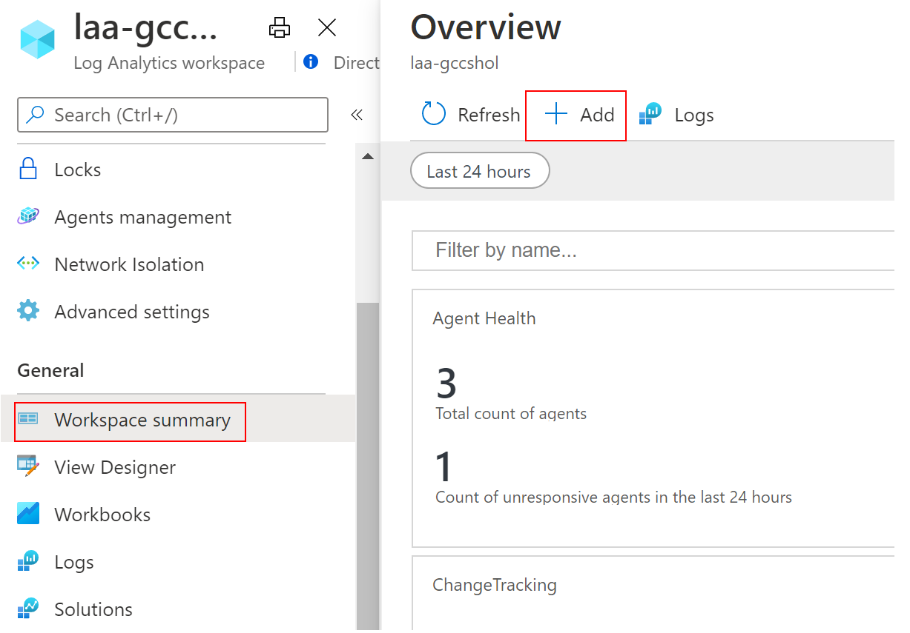
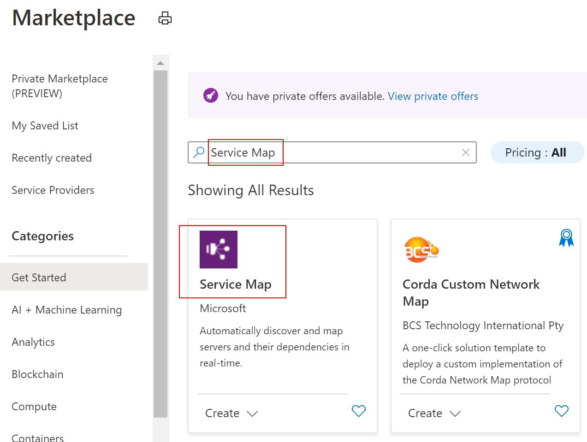

### Setup Log Collection
1. Connect all VMs to Log Analytics Workspace through
   * Azure Portal  
                
   * Or through [Powershell](https://docs.microsoft.com/en-us/azure/azure-monitor/insights/vminsights-enable-powershell)  
   
2. Add Linux and Windows Performance Counters configuration for Log Analytics agent to collect from VMs
                

3. Enable Azure Monitor for VM  
              

4. Enable [Service Map solution](https://docs.microsoft.com/en-us/azure/azure-monitor/insights/service-map#enable-service-map)  
              
               
   
5. Enable Change Tracking  
                
   
6. Activity Log to Log Analytics Workspace  
              
             
