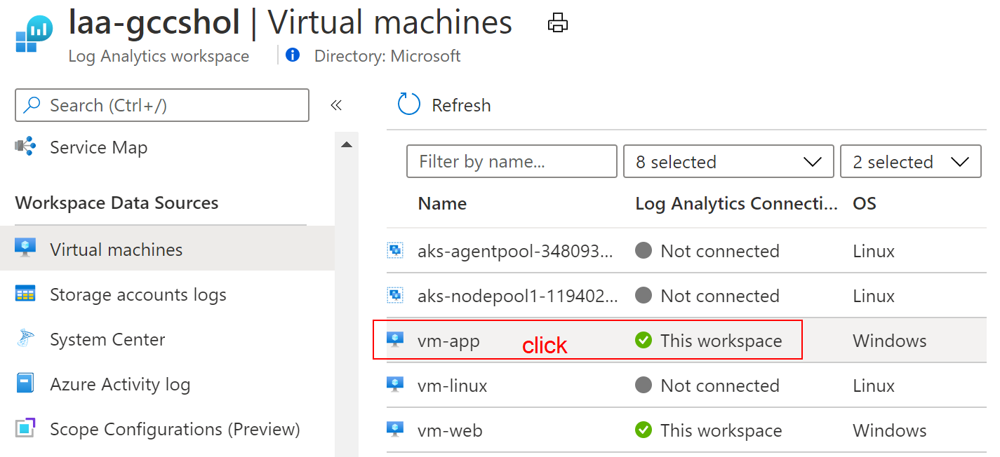
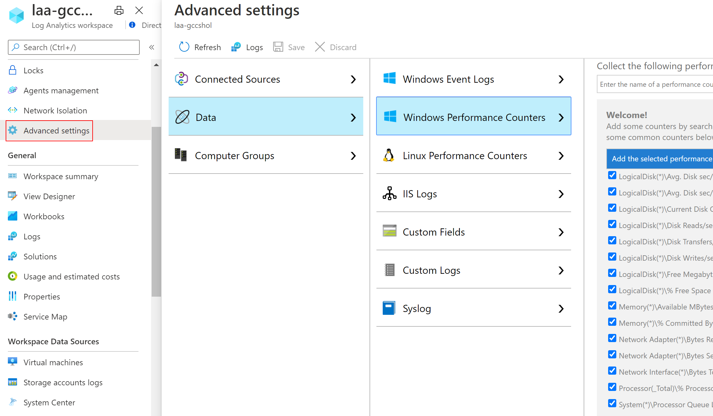
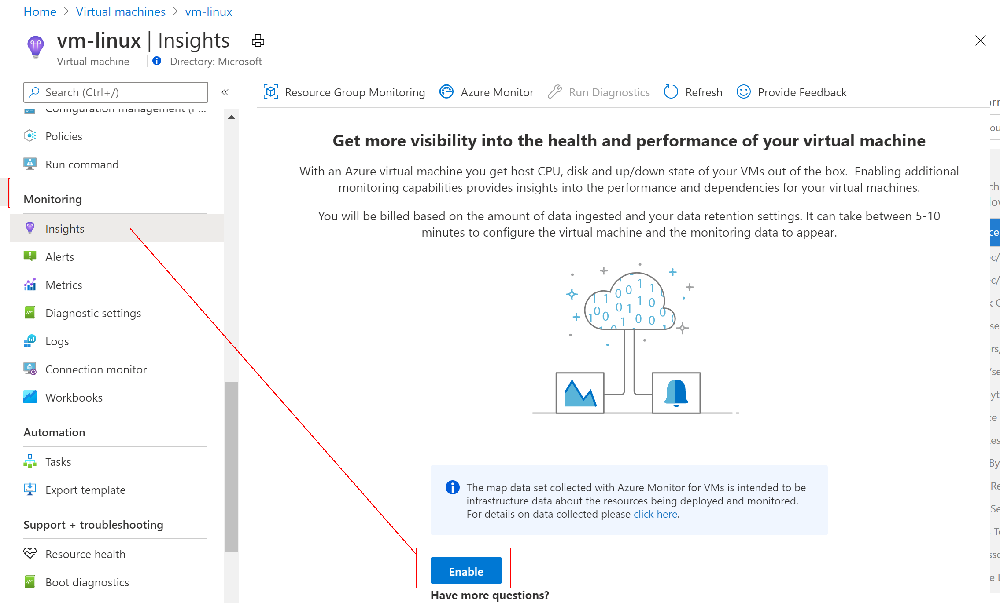
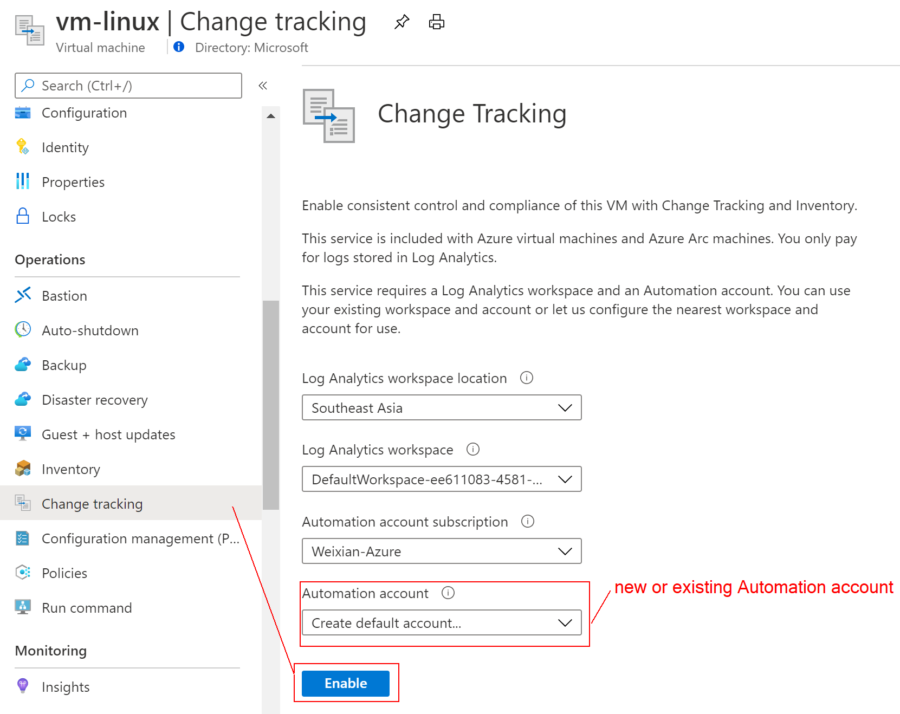
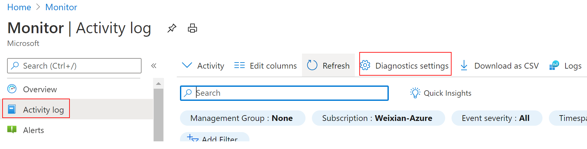
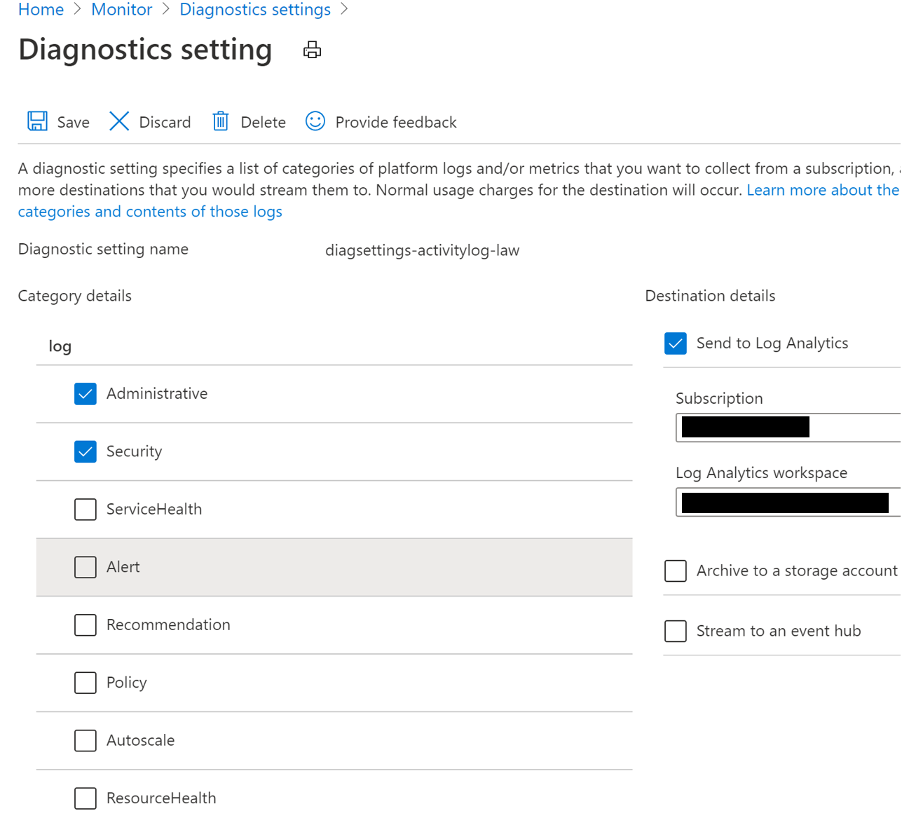

### Setup Log Collection  

1. Connect VMs Log Analytics
2. Setup Performance Counters configuration
3. Enable Azure Monitor for VM
4. Enable Change Tracking
5. Activity Log to Log Analytics Workspace  
6. Enable NSG Flow logs & Traffic Analytics
7. Add Network Performance Monitoring solution

#### Connect all VMs to Log Analytics Workspace through
* Azure Portal  
             
* Or through [Powershell](https://docs.microsoft.com/en-us/azure/azure-monitor/insights/vminsights-enable-powershell)  
   
#### Add Linux and Windows Performance Counters configuration for Log Analytics agent to collect from VMs  
            

#### Enable Azure Monitor for VM  
           
   
#### Enable Change Tracking  
             
   
#### Activity Log to Log Analytics Workspace  
           
               

#### NSG Flow logs & Traffic Analytics
Go to Network Watcher -> NSG Flow logs and watch out for NSG with Status "Disabled".  
Select NSG with Disabled status and select
   * Flow logs = "On"
   * Flow Logs version = 2
   * select a storage account to keep the raw logs
   * Go to Traffic Analytics status switch to "On" to enable Traffic Analytics
   * select Log Analytics to store aggregated logs of Traffic Analytics

#### Network Performance Monitor solution  
Follow [this doc](https://docs.microsoft.com/en-us/azure/azure-monitor/insights/network-performance-monitor) to setup NPM
